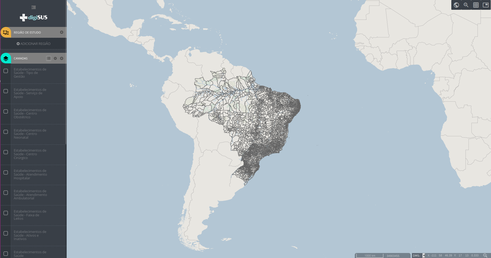
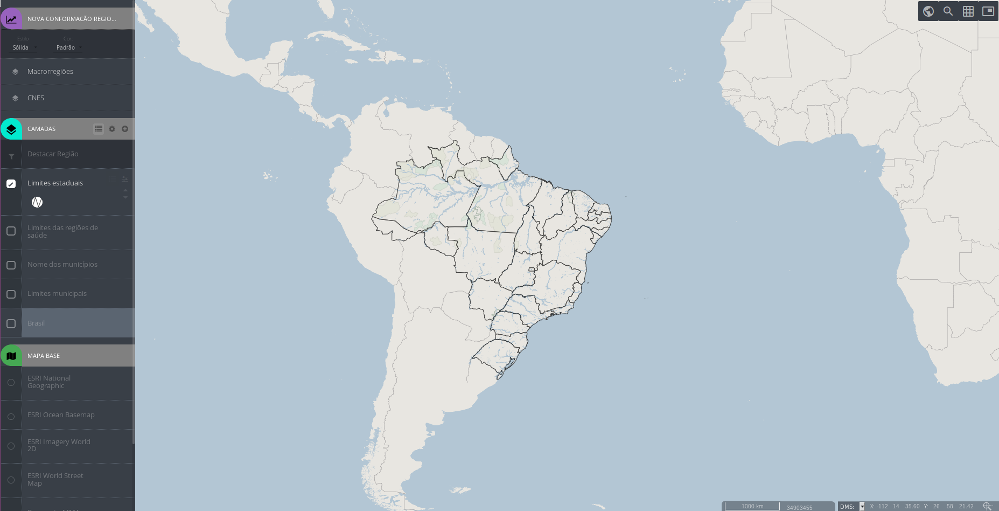
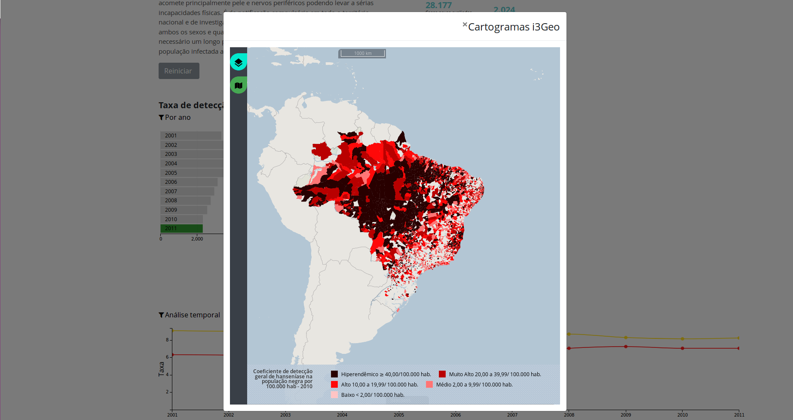
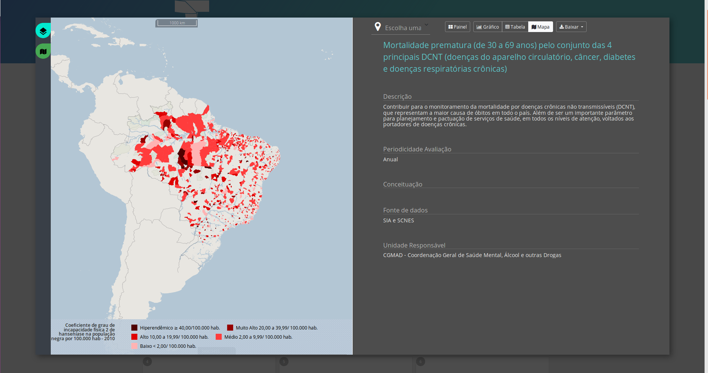

# digiSUS Gestor Geo

### Interfaces e construção de mapas

---
## digiSUS Gestor Geo
- Plataforma para o desenvolvimento de componentes de Geoprocessamento para o digiSUS Gestor.
- O digiSUS Gestor Geo baseia-se nos softwares livres i3Geo, Mapserver, PHP-Mapscript, OpenLayers, PostGis, entre outros.
- Repositório: https://bitbucket.org/manatus/esusgestorgeo

---
## Alterações no código original do i3Geo

Para o digiSUS Gestor Geo foram feitas as seguintes alterações nos valores default do arquivo `ms_configura.php`:

+++
## Alterações no código original do i3Geo

* `$esquemaadmin = "dbesusgestorgeo";` nome do esquema do banco de dados onde ficam as tabelas do sistema de administração do i3Geo

* `$base = $locaplic."/mapadasaude/base.map";` nome do arquivo mapfile utilizado na inicialização dos mapas


+++
## Alterações no código original do i3Geo

* `$ogcwsmap = $locaplic."/mapadasaude/ogcws.map";` nome do arquivo mapfile utilizado na geração dos serviços OGC

* `$conexaoadmin = $locaplic."/conecta_admin.php";` arquivo com a rotina que estabelece a conexão com o banco de dados de administração

+++
## Alterações no código original do i3Geo

* `$postgis_mapa` incluída uma rotina que define o valor dessa variável em função das variáveis de ambiente do SO

---
## Interfaces
<br>
- Novo Mapa da Saúde
- Mapas Especiais
- Mapas Incorporados em Painéis

---
### Organização das pastas
<br>
#### `esusgestorgeo/mapadasaude`
<br>
Contém os arquivos específicos da aplicação Novo Mapa da Saúde e programas que são compartilhados pelos outros tipos de mapa (especiais e painéis).

+++
#### Arquivos compartilhados
<br>
##### `base.map`
<br>
Mapfile de inicialização, é definido como variável de configuração em `ms_configura.php`.

+++
#### Arquivos compartilhados
<br>
##### `configMapaSaude.php`
<br>
Código javascript que define as variáveis globais com lista de camadas de fundo, o tipo de interface e a localização da aplicação i3Geo.

+++
###### Configurar opções de mapa base
```php
var eng = new ol.layer.Tile(
		{
			title : "ESRI National Geographic",
			visible : false,
			isBaseLayer : true,
			name : "eng",
			source : new ol.source.TileArcGISRest(
					{
						url : "http://server.arcgisonline.com/ArcGIS/rest/services/NatGeo_World_Map/MapServer",
						attributions : [ new ol.Attribution(
								{
									html : 'Tiles &copy; <a  href="http://server.arcgisonline.com/ArcGIS/rest/services/NatGeo_World_Map/MapServer">ArcGIS</a>'
								}) ]
					})
		});
var oce = new ol.layer.Tile(
		{
			title : "ESRI Ocean Basemap",
			visible : false,
			isBaseLayer : true,
			name : "oce",
			source : new ol.source.TileArcGISRest(
					{
						url : "http://server.arcgisonline.com/ArcGIS/rest/services/Ocean_Basemap/MapServer",
						attributions : [ new ol.Attribution(
								{
									html : 'Tiles &copy; <a  href="http://server.arcgisonline.com/ArcGIS/rest/services/Ocean_Basemap/MapServer">ArcGIS</a>'
								}) ]
					})
		});
var ims = new ol.layer.Tile(
		{
			title : "ESRI Imagery World 2D",
			visible : false,
			isBaseLayer : true,
			name : "ims",
			source : new ol.source.TileArcGISRest(
					{
						url : "http://server.arcgisonline.com/ArcGIS/rest/services/ESRI_Imagery_World_2D/MapServer",
						attributions : [ new ol.Attribution(
								{
									html : 'Tiles &copy; <a  href="http://server.arcgisonline.com/ArcGIS/rest/services/ESRI_Imagery_World_2D/MapServer">ArcGIS</a>'
								}) ]
					})
		});
var wsm = new ol.layer.Tile(
		{
			title : "ESRI World Street Map",
			visible : false,
			isBaseLayer : true,
			name : "wsm",
			source : new ol.source.TileArcGISRest(
					{
						url : "http://server.arcgisonline.com/ArcGIS/rest/services/ESRI_StreetMap_World_2D/MapServer",
						attributions : [ new ol.Attribution(
								{
									html : 'Tiles &copy; <a  href="http://server.arcgisonline.com/ArcGIS/rest/services/ESRI_StreetMap_World_2D/MapServer">ArcGIS</a>'
								}) ]
					})
		});
var bra = new ol.layer.Tile(
		{
			title : "Base carto MMA",
			visible : false,
			isBaseLayer : true,
			name : "bra",
			source : new ol.source.TileWMS(
					{
						url : "http://mapas.mma.gov.br/cgi-bin/mapserv?map=/opt/www/html/webservices/baseraster.map&",
						params : {
							'layers' : "baseraster",
							'srs' : "EPSG:4326",
							'format' : "image/png"
						}
					})
		});
var esus = new ol.layer.Tile(
		{
			title : "ESUS Gestor mapa base",
			visible : true,
			isBaseLayer : true,
			name : "osm",
			source : new ol.source.TileWMS(
					{
						url : "<?php echo $urlMapabase;?>/wms",
						params : {
							'layers' : "osm",
							'srs' : "EPSG:4326",
							'format' : "image/png"
						},
						attributions : [ new ol.Attribution(
								{
									html : '&copy; </a>'
								}) ]
					})
		});
```

@[1-15](Configuração de uma opção de mapa base)
@[3](Nome do mapa base para o usuário)
@[4](Informa se é o mapa base visível)
@[9](Endereço do serviço do mapa base)
@[77-96](Configuração do mapa base do digiSUS Gestor Geo)

+++
#### Arquivos compartilhados
<br>
##### `ogcws.map`
<br>
Mapfile base utilizado para construir os serviços OGC disponibilizados ao público em geral. Contém definições de autoria e contato com a fonte dos dados disponibilizados via requisição `getcapabilities`.

+++
#### Arquivos compartilhados
<br>
##### `tutorial*.php`
<br>
O arquivo `tutorialMapaSaude.php` aborda as funcionalidades gerais dos mapas como ferramentas de navegação e as funcionalidades gerais de cada módulo. Já os arquivos `tutorialCamadas.php` e `tutorialRegiaoEstudo.php` abordam as funcionalidades específicas de cada módulo. 

---
### Novo Mapa da Saúde



+++

### Novo Mapa da Saúde

- Ferramenta de visualização de informações geográficas com foco em Saúde
- Possui funcionalidades específicas que permitem ao usuário criar filtros por regiões geográficas, condições sociossanitárias e estabelecimentos de saúde, além de gerar relatórios e salvar suas opções.

+++

#### `mapadasaude.php`

Interface principal do mapa interativo. Contém os elementos HTML e o código Javascript necessários ao funcionamento do Novo Mapa da Saúde. Inclui ainda os parâmetros de configuração do i3Geo, destacando-se:

+++

##### Incluir camadas

```php
layers : {
	//array com a lista dos layers que serao adicionados e ligados (visiveis)
	add : ['mapadasaude_setores_censitarios',
			'mapadasaude_municipios_2010',
			'mapadasaude_nomes_municipios_2010',
			'limites_regiao_saude',
			'mapadasaude_cnes',
			'cnes_ativo_inativo',
			'cnes_qt_leitos',
			'cnes_st_atend_ambulatorial',
			'cnes_st_atend_hospitalar',
			'cnes_st_centro_cirurgico',
			'cnes_st_centro_neonatal',
			'cnes_st_centro_obstetrico',
			'cnes_st_servico_apoio',
			'cnes_tp_gestao',
		],
	//array com a lista dos layers que serao adicionados mas nao ligados
	on : ['mapadasaude_municipios_2010'],
	//array com os layers desligados
	off : ['mapadasaude_setores_censitarios',
			'mapadasaude_nomes_municipios_2010',
			'limites_regiao_saude',
			'mapadasaude_cnes',
			'cnes_ativo_inativo',
			'cnes_qt_leitos',
			'cnes_st_atend_ambulatorial',
			'cnes_st_atend_hospitalar',
			'cnes_st_centro_cirurgico',
			'cnes_st_centro_neonatal',
			'cnes_st_centro_obstetrico',
			'cnes_st_servico_apoio',
			'cnes_tp_gestao',]
},
```
@[3-16](Camadas da pasta temas que serão incluídas na lista de camadas do Novo Mapa da Saúde)
@[19](Camadas que serão adicionadas mas não ligadas)
@[21-33](Camadas desligadas)

+++

#### Customização da interface

```php
window.i3GEO_UI.start({
	barraOpen:true,
	mostraLogomarca:true, //se aparece ou n?o a logomarca
	secoes:{
		idsus:{
			exibir:false,
			aberto:false,
		},
		regiaoestudo:{
			  exibir:true,
			  aberto:true,
		},
		mapabase:{
			exibir:true,
			aberto:true,
		},
	}
});
```
---

### Mapas Especiais



+++

### Mapas Especiais

- Mapas Especiais abordam assuntos específicos e são abertos como páginas independentes do portal digiSUS. 
- Cada mapa especial pode utilizar uma interface diferente, com funcionalidades específicas, mas existem configurações que são comuns a todos os mapas desse tipo.

+++

### Mapas Especiais

- A criação de um mapa especial é padronizada, permitindo que os códigos sejam reaproveitados sempre que possível. 
- As interfaces dos mapas baseiam-se em templates, o que permite que vários mapas utilizem a mesma interface e que cada template possa ter funcionalidades diferentes.
- Os arquivos específicos para os mapas especiais ficam em `esusgestorgeo/mapasespeciais/`.

+++

### Mapas Especiais
<br>
#### `config_mapasespeciais.php`
<br>
- Os mapas especiais são registrados manualmente em um arquivo de configuração localizado em `esusgestorgeo/rest/linkmapa/config_mapasespeciais.php`.

+++

#### Configuração de uma mapa especial

```php
61 => array(
	"titulo"=>"Nova conforma&ccedil;&atilde;o regional",
	"idgrupo"=>1070,
	"banner"=>'<span class="portal"></span><br>',
	"identifica"=>"relatorios/macrorregioes/relatorio1",
	"configjs"=>"macrorregioes.js",
	"template"=>"padrao1.php",
	"perfil"=>"menugestor",
	"catalogo"=>array(
		"banner"=>"<font size='5' style='font-family: tahoma'></font>",
		"interno"=>true,
		"externo"=>true,
		"publico"=>true,
		"versao" => 7
	)
)
```

@[1](Id único para cada mapa)
@[2](Título do mapa)
@[3](Id do grupo no sistema de administração do i3Geo. Caso as camadas do mapa estejam referenciadas no objeto `MAPASESPECIAIS.LISTADECAMADAS` do arquivo `.js` correspondente, essa informação é desconsiderada)
@[6](Arquivo `.js` armazenado na pasta `esusgestorgeo/mapasespeciais/configjs` que será incluído no template. Esse arquivo controla os grupos e camadas que são incluídas no mapa)
@[7](Arquivo que será utilizado como interface para o mapa interativo. Os templates ficam armazenados na pasta `esusgestorgeo/mapasespeciais/templates`)

+++

### Mapas Especiais
<br>
#### `esusgestorgeo/mapasespeciais/configjs/*.js`
<br>
- Arquivos de configuração do catálogo de camadas que compõem um mapa especial.
- Os temas são armazenados dentro arrays formando subgrupos.

+++

#### Configuração das camadas de um mapa especial

```php
MAPASESPECIAIS.LISTADECAMADAS = {
		'data':{
			'subgrupo': [{
				'id_n2': 1190,
				'nome': 'Coeficiente de Detec&ccedil;&atilde;o',
				'temas': [{
					'id_n3': 1568,
					'nome_tema': 'Coeficiente de detec&ccedil;&atilde;o geral de hansen&iacute;ase na popula&ccedil;&atilde;o negra por 100.000 hab - 2010',
					'codigo_tema': 'legado/hanseniase_novos_casos_2010'
				}, {
					'id_n3': 1569,
					'nome_tema': 'Coeficiente de grau de incapacidade f&iacute;sica 2 de hansen&iacute;ase na popula&ccedil;&atilde;o negra por 100.000 hab - 2010',
					'codigo_tema': 'legado/hanseniase_incap_grau_2_2010'
				}]
			}]
		}
};
```	

@[4](Id do subgrupo. Deve ser único no arquivo em questão)
@[5](Nome do subgrupo)
@[7](Id do tema. Deve ser único no arquivo em questão)
@[8](Nome do tema)
@[9](Nome do arquivo mapfile do tema tendo a pasta `esusgestorgeo/temas` como raiz)

+++

### Mapas Especiais
<br>
#### `abremapa.php`
<br>
- Para abrir um mapa especial inclua o id como parâmetro para o programa `/esusgestorgeo/mapasespeciais/abremapa.php`. 
- Clique [aqui](http://digisus-geo-homologacao.saude.gov.br/esusgestorgeo/mapasespeciais/abremapa.php?id=35) para ver um exemplo.

---

### Mapas incorporados em painéis



+++

### Mapas incorporados em painéis



+++

### Mapas incorporados em painéis

- São mapas que acompanham um painel de informações de um indicador ou um conjunto de indicadores
- Incluem camadas que dizem respeito aos indicadores representados no painel
- Os arquivos específicos para os mapas incorporados em painéis ficam em `esusgestorgeo/mapaspaineis/`.

+++

### Mapas incorporados em painéis
<br>
#### `mapa1.php`
<br>
- Programa que gera os mapas incorporados em paineis
- Para criar um novo mapa deve-se incluir parâmetros pela url na inicializalção do programa

+++

#### Parâmetros de mapas incorporados em painéis

 - `metaestatids` - Lista com os códigos dos indicadores conforme consta no MGI (coluna `id_medida_variavel` da view `dbesusgestorgeo.i3geoestat_medida_variavel`
 - `temas` - Lista dos mapfiles da pasta `esusgestorgeo/temas` contendo os temas que serão incluídos no mapa
 - `visiveis` - Lista das camadas que abrem ligadas no mapa. As camadas sao definidas nos parâmetros `temas` e `metaestatids`

+++

#### Parâmetros de mapas incorporados em painéis

 - `itabela` - Nome de um arquivo php existente em `esusgestorgeo/mapaspaineis/relatorios` que será aberto na função de identificação. Não utilize a extensao `.php`
 - `itabelaw` - Largura da janela `itabela`
 - `itabelah` - Altura da janela `itabela`

+++

#### Parâmetros de mapas incorporados em painéis

 - `campo` - Nome da coluna da tabela utilizada para criar uma máscara sobre o mapa. É preenchido automaticamente pela aplicação
 - `valor` - Valor a ser utilizado em conjunto com o parâmetro campo (utiliza-se o conector "diferente de" para compor a máscara)

---
## Links e suporte

- @fa[bitbucket][ Repositório digiSUS Gestor Geo](https://bitbucket.org/manatus/esusgestorgeo)
- @fa[gitlab][ Repositório i3Geo](https://softwarepublico.gov.br/gitlab/i3geo/i3geo)
  + @fa[bug][ Bugs](https://softwarepublico.gov.br/gitlab/i3geo/i3geo/issues)	
- @fa[wikipedia-w][ Wiki i3Geo](https://softwarepublico.gov.br/gitlab/i3geo/i3geo/wikis/home)
  + @fa[wikipedia-w][ Para desenvolvedores](https://softwarepublico.gov.br/gitlab/i3geo/i3geo/wikis/para-desenvolvedores-indice)
  + @fa[wikipedia-w][ Roteiro do Sistema de Administração](https://softwarepublico.gov.br/gitlab/i3geo/i3geo/wikis/roteiro-sistema-administracao) 

---


## Perguntas?

<br>

@fa[medium]( caixetaunb@gmail.com)
<br>
@fa[whatsapp]( 61 9677-5005)
<br>
@fa[mobile]( 61 99677-5005)
