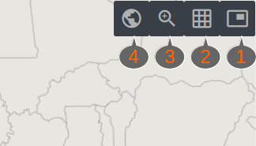

# digiSUS Gestor Geo

### Operação do Novo Mapa da Saúde

---
## digiSUS Gestor Geo
- Plataforma para o desenvolvimento de componentes de Geoprocessamento para o digiSUS Gestor.
- O digiSUS Gestor Geo baseia-se nos softwares livres i3Geo, Mapserver, PHP-Mapscript, OpenLayers, PostGis, entre outros.
- Repositório: https://bitbucket.org/manatus/esusgestorgeo

---
## Interfaces
 
- Novo Mapa da Saúde
- Mapas Especiais
- Mapas Incorporados em Painéis

---
### [Novo Mapa da Saúde](http://digisus-geo-homologacao.saude.gov.br/esusgestorgeo/mapadasaude/)

+++

### Novo Mapa da Saúde

- Ferramenta de visualização de informações geográficas com foco em Saúde
- Possui funcionalidades específicas que permitem ao usuário criar filtros por regiões geográficas, condições sociossanitárias e estabelecimentos de saúde, além de gerar relatórios e salvar suas opções.

---

#### Ferramentas de navegação

- **1 - Mapa de referência:** Apresenta uma miniatura de um mapa geral identificando a localização da visualização atual
- **2 - Grade de coordenadas:** Inclui uma grade de coordenadas para referência de navegação

+++

#### Ferramentas de navegação

- **3 - Zoom:** Possibilita aproximar em uma localidade a partir da seleção de uma localização na tela
- **4 - Enquadramento inicial:** retornar para o zoom e localização inicial do mapa

---

#### Menu Lateral

- **1 -** Recolhe e abre o menu
- **2 -** Define a Região de Estudo a partir de regionalizações político-administrativas, condições sociossanitárias e geometrias inseridas no mapa. A Região de Estudo definida servirá para filtrar as camadas de Estabelecimentos de Saúde e Indicadores do MGDI.

+++

- **3 -** Apresenta as camadas incluídas no mapa e o possibilita a inclusão de novas camadas a partir de um catálogo
- **4 -** Apresenta as opções de mapas de fundo para personalização da visualização das camadas 

---
## Links e suporte

- @fa[bitbucket][ Repositório digiSUS Gestor Geo](https://bitbucket.org/manatus/esusgestorgeo)
- @fa[gitlab][ Repositório i3Geo](https://softwarepublico.gov.br/gitlab/i3geo/i3geo)
  + @fa[bug][ Bugs](https://softwarepublico.gov.br/gitlab/i3geo/i3geo/issues)	
- @fa[wikipedia-w][ Wiki i3Geo](https://softwarepublico.gov.br/gitlab/i3geo/i3geo/wikis/home)
  + @fa[wikipedia-w][ Para desenvolvedores](https://softwarepublico.gov.br/gitlab/i3geo/i3geo/wikis/para-desenvolvedores-indice)
  + @fa[wikipedia-w][ Roteiro do Sistema de Administração](https://softwarepublico.gov.br/gitlab/i3geo/i3geo/wikis/roteiro-sistema-administracao) 

---

## Perguntas?

 

@fa[medium]( caixetaunb@gmail.com)
 
@fa[whatsapp]( 61 9677-5005)
 
@fa[mobile]( 61 99677-5005)
